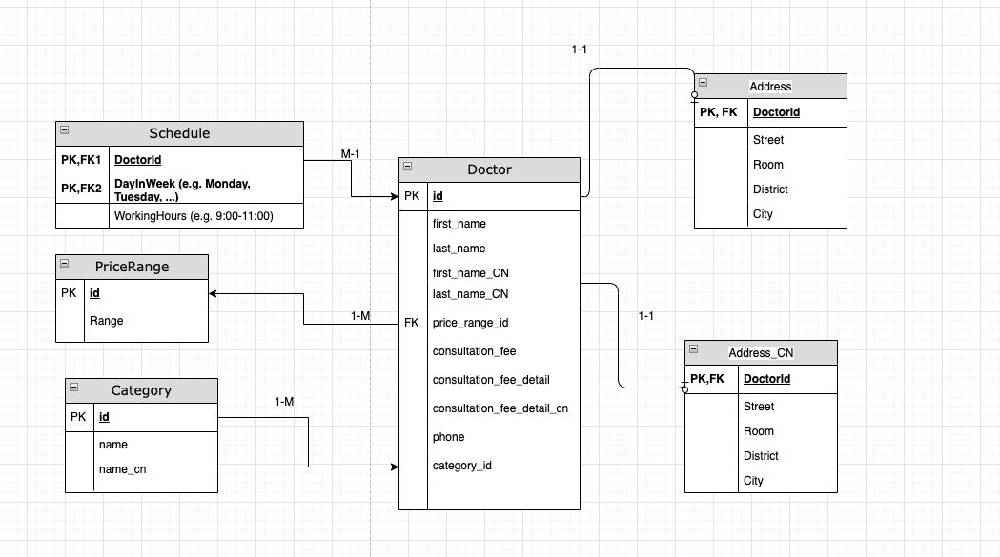

# Zihao_Cai_Senior_Backend_Engineer_Technical_Assessment

## Swagger

http://127.0.0.1:8000/docs

## ER Diagram

Path to ER Diagram: Zihao_Cai_Senior_Backend_Engineer_Technical_Assessment/ER.png

Doctor table is the main dynamic table with foreign key reference to Address and AddressCN, and a one to many
relationship with Schedule, since a doctor would have schedule entries from monday to Sunday in different rows.
PriceRange and Category table are static table which holds configuration data and having one to many relationship with
Doctor table

## DB model assumption:

1. A doctor works in only one agency (single address for a doctor 1-1 relationship)
2. A doctor specialized in one area (1-1 relationship between doctor and category)
3. smaller scope for address without province, country, and postal code for simplicity

## Choice of Framework & Library:

FastAPI - FastAPI is a modern, light-weight, high-performance web framework for building APIs.
What i like most is the auto-generated Swagger and easy to format API design and codes in good standard.
The documentation is insanely intuitive. Pydantic-based data model define easy-to-use validations.

FastAPI-Starlette: very neat middleware tooling framework allows me to customized
request and response elegantly.

SQLModel - SQLModel library is built based on Pydantic and SQLAlchemy
for FastAPI webframework to interact with database easily.
The back populate feature is the shiniest part of this library.

## Potential Improvement:

Testing with test-database which require much more time and effort to configure and prepare mock data.
More tests for better coverage if time sufficient
Better data structure/ table design for calendar (doctor schedule).

## Production consideration:

Could introduce a env variable to the app entry point start_app function to distinguish prod and dev environment
Could integrate with more robust data logging and alert system: prometheus, grafana, datadog, splunk...
Docker-compose to spin up all services and database.
This service can be easily structured as microservices, and support horizontal scaling nicely.
Logging level config and close database logs for production
